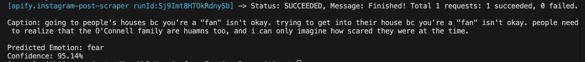

# Emotion Recognition with Fine-Tuned Transformers

This project fine-tunes transformer models on the **dair-ai/emotion** dataset to classify text into 6 emotions: *Sadness, Joy, Love, Anger, Fear, Surprise*.

## Model Comparison (2 Epochs)
Fi  ne-tuned and compared three models. Although **BERT** achieved the highest accuracy, **DistilBERT** was selected for the final implementation due to speed and smaller size with minimal performance tradeoff.

| Model | Accuracy | F1 Score | Loss | Note |
| :--- | :--- | :--- | :--- | :--- |
| **BERT** (`bert-base-uncased`) | **0.9285** | **0.9288** | **0.1951** | Highest Accuracy |
| **DistilBERT** (`distilbert-base-uncased`) | 0.9235 | 0.9234 | 0.2120 | **Selected (Fast/Efficient)** |
| **RoBERTa** (`roberta-base`) | 0.9200 | 0.9205 | 0.2111 | - |

## Project Components
1. **`model.py`**:
   - Simple inference script.
   - Takes a user-typed sentence and classifies the emotion.

2. **`predict_emotion.py`**:
   - Real-world application.
   - Uses **Apify** to scrape Instagram captions and predicts the emotion for each post.

   

3. **Notebooks**:
   - `emotion classification.ipynb`: Data analysis & fine-tuning implementation.
   - `model_comparison.ipynb`: Detailed training & evaluation of the 3 models.
